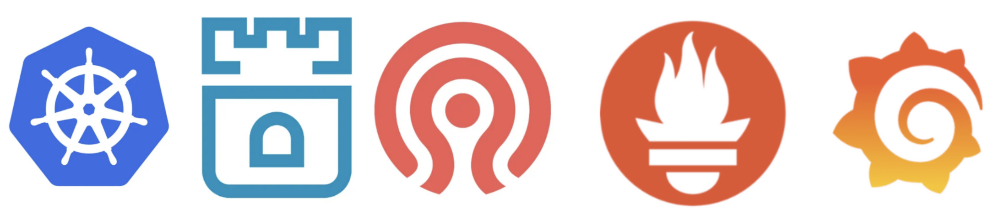
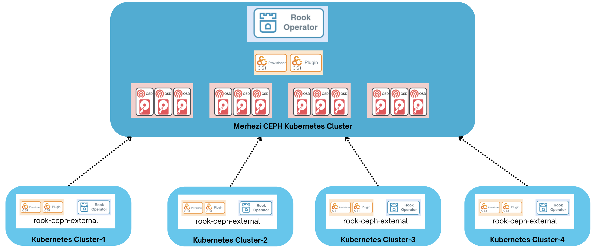
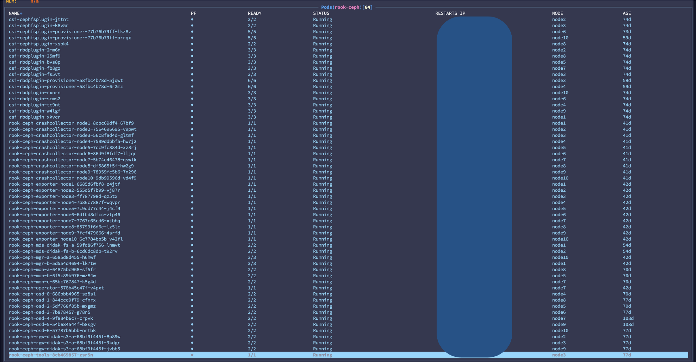
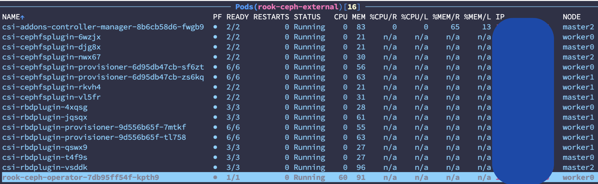

# Rook - CEPH External Helm-stack





Rook, küme dışında kurulu olan herhangi bir Ceph veya Rook depolama sistemini external modda kullanacak şekilde ayarlanabilir. External modda, harici kümedeki Ceph'e bağlanmayı sağlayan CSI sürücüleri ve diğer temel kaynaklar için yapılandırmalar sağlanır. 

**Source cluster:** Depolama sağlayan küme

**Consumer cluster:** Harici kaynak kümesini kullacak olan k8s kümesi

## Merkezi Rook-Ceph Kurulumu

### Ön Gereksinimler

* [Minimum donanım önerileri](https://docs.ceph.com/en/quincy/start/hardware-recommendations/#minimum-hardware-recommendations)
* Kubernetes Cluster (en az 3 worker olmalı) 
* Worker düğümlerde,  bölümlendirilmemiş/biçimlendirilmiş dosya sistemi olmayan disk/diskler.
* Her düğümde NTP senkronizasyonu sağlanmalı
* [Gereksinim detayları](https://rook.io/docs/rook/latest-release/Getting-Started/Prerequisites/prerequisites/)
* [Kurulumda uygulabilecek iyi pratikler](https://documentation.suse.com/sbp/storage/html/SBP-rook-ceph-kubernetes/index.html)
 
### Kurulum

1-) Affinity ihtiyaçları için worker düğümlere **role=storage-node** etiketi eklenir. Örnek:

```sh
for i in {4..11}; do kubectl label nodes node$i role=storage-node; done
```

2-) ArgoCD üzerinden **rook-operator** (helm-stack altında) projesi oluşturularak senkronize edilir. Senkronizasyon tamamlandığında **rook-ceph** namespace'inde *rook-ceph-operator* podu görülür.


3-) PersistentVolumeClaims (PVC) üzerine annotasyon ekleyerek alan geri kazanma işlemini (ReclaimSpaceCronJob) için  [csi-addons](https://github.com/csi-addons/kubernetes-csi-addons/tree/main) kurulumu yapılır:

```sh
echo "########################   csi-addons CRD yükleniyor...   ########################"
cd deploy/kubernetes-csi-addons-v0.8.0/deploy/controller
kubectl apply -f crds.yaml

echo
echo "########################   csi-addons rbac yükleniyor...   ########################"
kubectl apply -f rbac.yaml

echo
echo "########################   csi-addons yükleniyor...   ########################"
kubectl apply -f setup-controller.yaml

echo
echo "########################   csi-addons konfigurasyonları yapılıyor...   ########################"
kubectl apply -f csi-addons-config.yaml
```

5-) ArgoCD üzerinden **ceph-cluster** (helm-stack altında) projesi oluşturularak senkronize edilir. Senkronizasyon zaman alabilir. rook-ceph namespacesinin durumu:



6-) ArgoCD üzerinden **prometheus-stack** (helm-stack altında) projesi oluşturularak senkronize edilir. Senkronizasyon tamamlandığında **monitorin** namespace'inde [kube-prometheus-stack](https://github.com/prometheus-community/helm-charts/tree/main/charts/kube-prometheus-stack) ile Prometheus, Grafana ve Alertmanager kurulumu yapılmış olur.

7-) Rook üzerinde, izleme işlemleri için ayarlamalar yapılır. 
* ceph-cluster.yaml'da monitoring ve Rule'lar aktif edilir.
    ```yaml
      monitoring:
        enabled: true
        createPrometheusRules: true
    ```
* ceph-operator.yaml'da monitoring aktif edilir.
    ```yaml
    monitoring:
      enabled: true
    ```
* ceph-cluster.yaml'da prometheusEndpoint ve ssl satırlarındaki yorum kaldırılıp monitoring namespace'indeki prometheus podunun ip'si verilir. DNS kabul edilmez.
    ```yaml
    dashboard:
      enabled: true
      ssl: false
      prometheusEndpoint: http://x.x.x.x:9090
      prometheusEndpointSSLVerify: false
    ```
* prometheus-grafana.yaml'da önceden oluşturulan msteams *webhook_url* ayarlanır.
    ```yaml
    msteams_configs:
      - webhook_url: 'xxxxxx'
        send_resolved: true
    ```
### Arayüz Erişimleri

#### CEPH Dashboard
* nodePort: 30002 üzerinden erişilir.
* nodePort: 30003 RGW uçnoktası.
```sh
kubectl -n rook-ceph get secret rook-ceph-dashboard-password -o jsonpath="{['data']['password']}" | base64 --decode && echo
```
#### Prometheus
* nodePort: 30005 üzerinden erişilir.

#### Alertmanager
* nodePort: 30007 üzerinden erişilir.
* varsayılan kullanıcı: admin  parola: prom-operator

#### Grafana
* nodePort: 30006 üzerinden erişilir.
* varsayılan kullanıcı: admin  parola: prom-operator

Örnek CEPH izleme dashboardları eklenebilir:  
* [Ceph Cluster](https://grafana.com/grafana/dashboards/2842-ceph-cluster/) 
* [Ceph - CephFS](https://grafana.com/grafana/dashboards/9340-ceph-cephfs/)
* [kube-prometheus-stack](https://github.com/prometheus-community/helm-charts/tree/main/charts/kube-prometheus-stack)
* [Ceph - Pools](https://grafana.com/grafana/dashboards/5342-ceph-pools/)


## Rook-Ceph External Kurulumu

External modda disk yönetimi ve depolama kaynak cluster tarafından yapıldığı için kurulum yapılan kümede bölümlendirilmemiş/biçimlendirilmiş dosya sistemi olmayan disk/disklere ihtiyaç duymaz.
mon, osd, mgr vs podları external modda oluşturulmaz böylece cluster kaynak kullanım avantajı sağlar.

External kurulumda kullanılan kaynaklar:
```
deploy/ceph-external/
├── ceph-cluster-external.yaml            -------------> external modda küme oluşturur
├── ceph-operator-external.yaml           -------------> ceph-operator.yaml ile içerik olarak aynı, namespace değişiklikleri yapılmış hali
├── common-external.yaml                  -------------> external modda çalıştırabilmek için gerekli ortak gereksinimler
├── common.yaml                           -------------> Ortak gereksinimler
├── crds.yaml                             -------------> Operator CRD'leri
├── create-external-cluster-resources.py  -------------> Harici kaynak kümeden gerekli bilgileri almak için kullanılır.
└── import-external-cluster.sh            -------------> Consumer kümede create-external-cluster-resources.py çıktısını import eder.
```

### Harici Kümeye Bağlantı Bilgilerini Alma

Harici küme üzerinde **create-external-cluster-resources.py** scripti kullanılarak bağlantı bilgileri oluşturulur. Bu işlem bir kez yapılıp **import-external-cluster.sh** içeriği güncellenmesi yeterlidir. Her k8s kümesi için merkezi CEPH'de yeni bir pool oluşturulur. Sonraki merkezi CEPH bağlantılarında sadece kurulum yapılan küme tarafından kullanılacak **RBD_POOL_NAME** değiştirilip **install-external.sh** çalıştırılır.

1-) **create-external-cluster-resources.py** toolbox imajı içerisine kopyalanır:

```sh
toolbox=$(kubectl get pod -l app=rook-ceph-tools -n rook-ceph -o jsonpath='{.items[*].metadata.name}')
kubectl -n rook-ceph cp deploy/ceph-external/create-external-cluster-resources.py $toolbox:/etc/ceph
```

2-) toolbox imajına bağlanarak scriptin kopyalandığı doğrulanır:

```sh
kubectl -n rook-ceph exec -it deploy/rook-ceph-tools -- bash
bash-4.4$ cd /etc/ceph; ls -l
total 96
-rw-r--r-- 1 2016 2016   118 Apr  2 14:39 ceph.conf
-rw-r--r-- 1 2016 2016 89665 Apr  2 14:57 create-external-cluster-resources.py
-rw-r--r-- 1 2016 2016    62 Apr  2 14:24 keyring
```

3-) Script kurulum yapılan küme için kullanılacak pool ismi güncellenerek çalıştırılır. Daha fazla parametreye [buradan](https://rook.io/docs/rook/v1.14/CRDs/Cluster/external-cluster/external-cluster/#1-create-all-users-and-keys) ulaşabilirsiniz:

```sh
python3 create-external-cluster-resources.py --rbd-data-pool-name didak1-pool --namespace rook-ceph-external --v2-port-enable --skip-monitoring-endpoint --format bash
```

Beklenen çıktı aşağıdakine benzer şekilde olmalıdır:
```sh
export NAMESPACE=rook-ceph-external
export ROOK_EXTERNAL_FSID=x-x-x-x-x
export ROOK_EXTERNAL_USERNAME=client.healthchecker
export ROOK_EXTERNAL_CEPH_MON_DATA=a=x.x.x.x:3300
export ROOK_EXTERNAL_USER_SECRET=x
export ROOK_EXTERNAL_DASHBOARD_LINK=https://x.x.x.x:8443/
export CSI_RBD_NODE_SECRET=x
export CSI_RBD_NODE_SECRET_NAME=csi-rbd-node
export CSI_RBD_PROVISIONER_SECRET=x
export CSI_RBD_PROVISIONER_SECRET_NAME=csi-rbd-provisioner
export RBD_POOL_NAME=didak1-pool
export RGW_POOL_PREFIX=default
```
**ROOK_EXTERNAL_CEPH_MON_DATA**, merkezi kümenin host networkünü kullanarak ip aldığından emin olun. Ceph Cluster CRD'deki hostNetwork parametresi ile bu sağlanmıştır. DNS ismi üzerinden mon'lara erişim yapılamaz. 
Script çıktısında sadece bir tane mon adresleniyor ve rook bunun üzerinden diğer monları bulabiliyor. Diğer mon adresleri manuel olarak da verilebilir.


### Consumer Kümeyi External Modda Çalıştırma
1-) Bir önceki adımda edinilen harici küme bilgileri **import-external-cluster.sh** export edilen değerler ile değiştirilir:

```sh
vi deploy/ceph-external/import-external-cluster.sh
```

2-) **install-external.sh** scripti çalıştırılır.
```sh
./install-external.sh
```

3-) Kurulum başarılı şekilde yapıldığında küme içerisinde **ceph-rbd** isminde bir StorageClass ve aşağıdaki podlar oluşturulur:



4-) External modda başlatılan kümeyi test etmek için aşağıdaki yaml dosyası çalıştırılır:

```yaml
apiVersion: v1
kind: PersistentVolumeClaim
metadata:
  name: test-ceph-external-pvc
  namespace: rook-ceph-external
spec:
  storageClassName: ceph-rbd
  accessModes:
    - ReadWriteOnce
  resources:
    requests:
      storage: 20Gi
---
apiVersion: v1
kind: Pod
metadata:
  name: test-ceph-external
  namespace: rook-ceph-external
spec:
  containers:
    - name: ceph-external-container
      image: alpine
      command: ["/bin/sh", "-c"]
      args:
        - "dd if=/dev/urandom of=/data/random-data bs=1M count=15360; sleep infinity" # 15 GB veri yazılır
      volumeMounts:
        - name: external-storage
          mountPath: "/data"
  volumes:
    - name: external-storage
      persistentVolumeClaim:
        claimName: test-ceph-external-pvc
```

### External Mod Kurulumunu Kaldırma

1-) uninstall-external.sh scripti çalıştırılır.

```sh
./uninstall-external.sh
```
